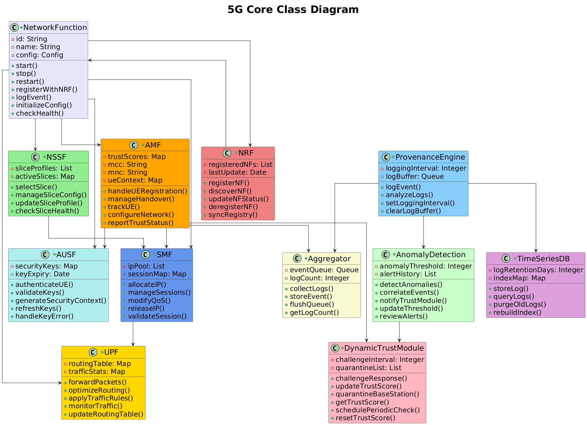

# 🛜 5GCORE: Cloud-Native 5G Core Security Framework  
*CSEN241 (Graduate Cloud Computing) • Winter 2025 project* 

  
  

> ⭐️ A sprint to prove that dynamic, zero-trust security belongs inside a containerised 5G core without killing latency. 

> ❓ Why? The RAN⇄Core trust gap is only widening as 5G moves toward 6G. Scaling this prototype to multi-vendor slices and stress testing the fuzzy engine under real mobility traces are wide-open research (and startup!) opportunities.

Please see the [full paper (PDF)](./docs/5GCORE_MW.pdf) and [slide deck defense](./docs/Project_Defense_3_18.pdf) for architecture, hypotheses, and results.  

| Problem | Proof-of-concept |
|---------|---------------------|
| Monolithic / VNF 5G cores waste resources and leave giant security blind spots. | **Open5GS split into micro-services**, each wrapped in a Docker container. |
| Rogue gNBs can still masquerade as real base stations. | **Fuzzy-logic trust engine** rejects rogue gNBs in \< 10 ms (≈9 ms avg). |
| Attack forensics are slow and manual. | **Provenance DAG** logs every NF-to-NF call for 96 % attack-attribution accuracy. |
| Cloud/edge mix adds policy drift. | Early tests show \< 15 % CPU overhead while keeping control-plane in cloud and UPF at the edge. |

## Results 
| Metric | Value |
|--------|-------|
| Rogue-gNB block rate | **92 – 97 %** |
| Auth latency | **\< 10 ms** (avg ≈ 9 ms) |
| Provenance overhead | **≈ 12 % CPU** |
| Attribution accuracy | **96 %** |

## ⭐️ Architecture 

- **Container-first 5G core** — Open5GS functions run as independent CNFs with rolling updates & per-NF autoscaling.  
- **Real-time zero-trust layer** — Fuzzy rules blend auth failures, handover anomalies & provenance outliers into a live trust score.  
- **Provenance-based security** — Directed-acyclic graphs track every SBI call; suspicious paths trigger auto-quarantine.  
- **Edge / cloud split** — Control plane in AWS, latency-critical UPF on an edge node; no policy drift thanks to sync’d trust store.  

### Core Class Diagram

  

### Fuzzy Logic Model

  

## ⭐️ Links

[Full paper (PDF)](./docs/5GCORE_MW.pdf)  
[Slide deck / project defense](./docs/Project_Defense_3_18.pdf)

> 📌 Note: Full SRC source was not approved for release after submission.

---
