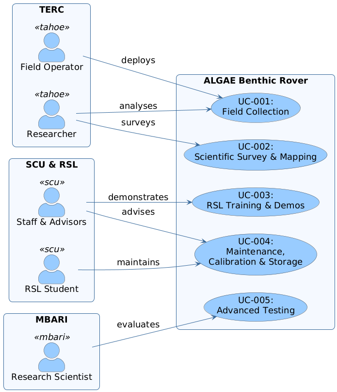
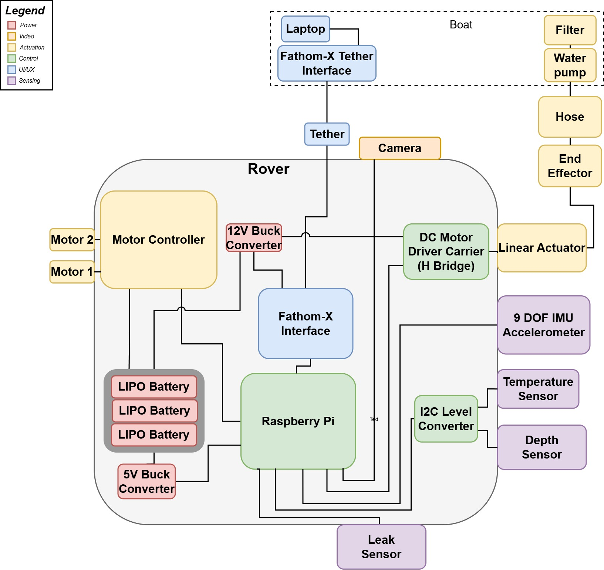
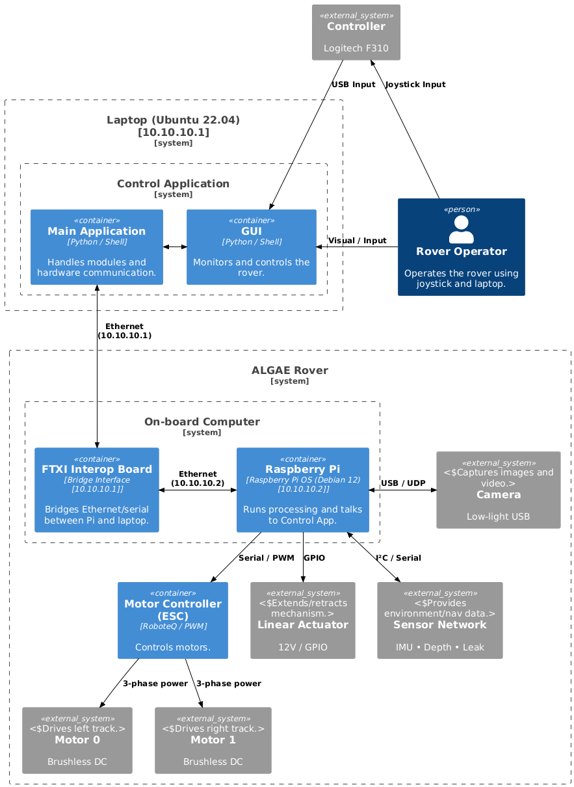
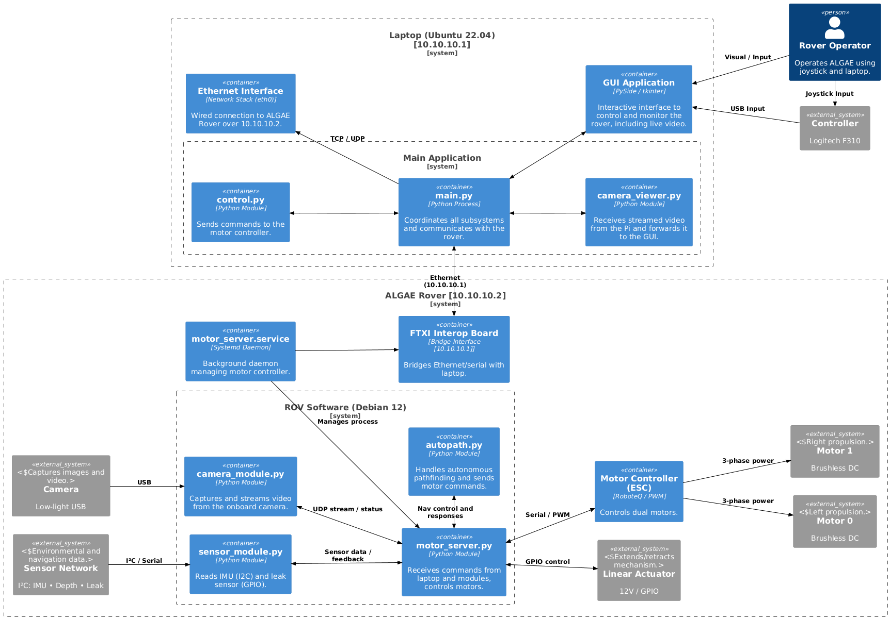
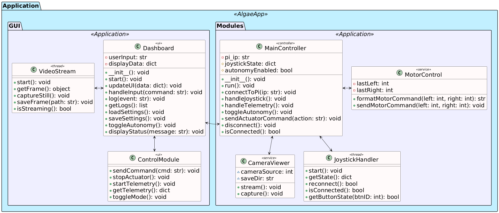
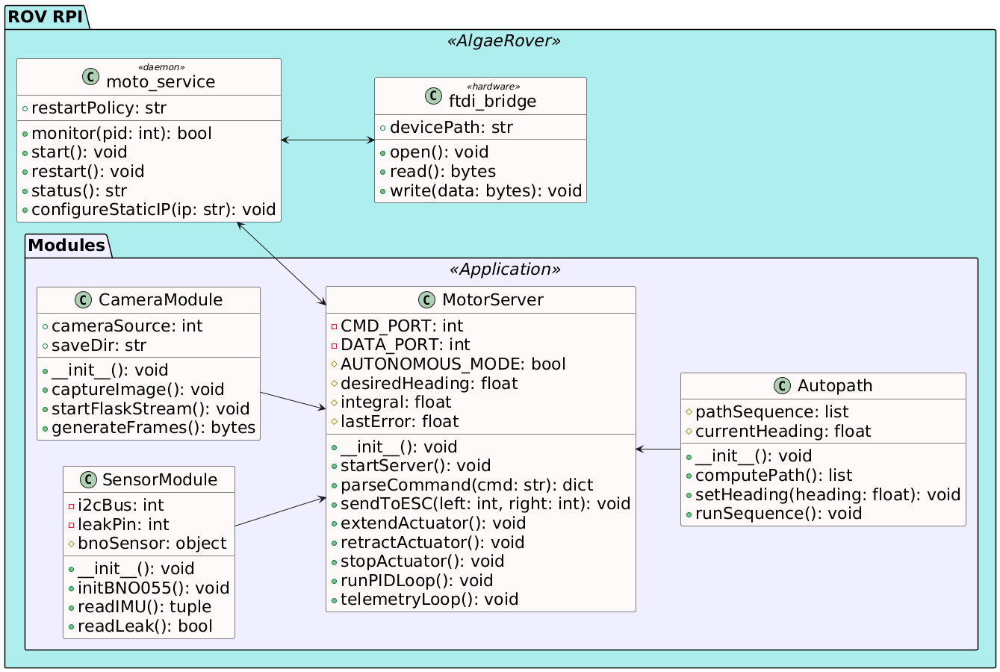
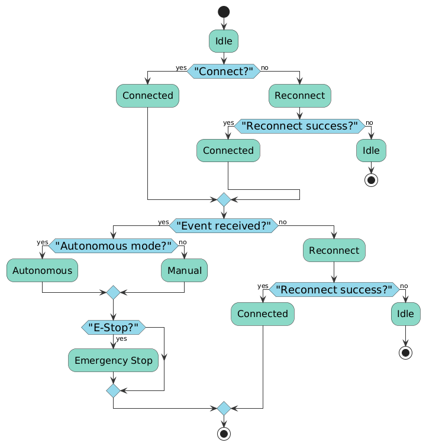
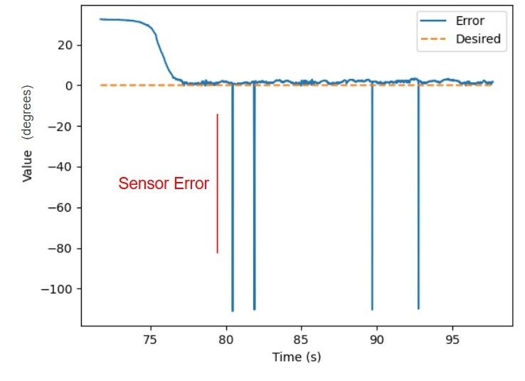

# 🌿 ALGAE: Advanced Lakebed Guardian & Algae Eradicator

**Research Lab:** Santa Clara University: Robotics Systems Laboratory (RSL)  
**Capstone:** Sep 2024 – June 2025 
**Team:** Mnason Chan · Jakob Lelong · William Torborg · **Marley W.** · Lucas Woodford  
**Advisors:** Dr. Chris Kitts · Dr. Michael Neumann  

<p align="center">
  
  
</p>


## ⭐️ Overview 

> 🌿 Please see the full thesis (in `documents/`) for comprehensive project context, problem framing, testing procedures, and detailed engineering process.

<table>
  <tr>
    <td style="vertical-align: top; width: 60%; padding-right: 20px;">
      <ul>
        <li><strong>Objective:</strong>
          <ul>
            <li>Tethered robotic rover that removes benthic algae <em>in situ</em>, safeguarding Lake Tahoe’s clarity and $50 M recreation economy.</li>
            <li>Autonomously remove invasive algae at up to 110 GPM flow.</li>
          </ul>
        </li>
        <li><strong>Results:</strong>
          <ul>
            <li>Electronics enclosure depth-rated to 10 m with &lt; 0.05 psi leakback</li>
            <li>Reliable Algae Removal for deployments less than 4 hours</li>
          </ul>
        </li>
        <li><strong>Awards & Publication:</strong>
          <ul>
            <li>🏆 Winner, RSL Excellence in Capstone (Class of 2025)<br/>
              <a href="https://www.scu.edu/commencement/undergraduate2025/class-of-2025-student-awards/">Awards list → SCU Commencement</a><br/>
              <a href="https://www.scu.edu/engineering/undergraduate/senior-design/2025-senior-design/results/">Engineering results → SCU Eng Senior Design</a>
            </li>
            <li>Thesis will be published → <a href="https://scholarcommons.scu.edu">SCU Scholar Commons</a> (see <code>ALGAE/documents</code>)</li>
          </ul>
        </li>
      </ul>
    </td>
    <td style="vertical-align: top; text-align: center; width: 50%;">
      
    </td>
  </tr>
</table>

<h2>System architecture</h2>

<table>
  <tr>
    <td style="vertical-align: top; width: 60%;">
      <ul>
        <li><strong>Mechanical:</strong> Aluminum chassis, tracked drivetrain, linear-actuated suction head, hybrid vortex filter.</li>
        <li><strong>Electrical:</strong>
          <ul>
            <li>Bulkhead penetrators, pressure-compensated electronics pod, Raspberry Pi 4 companion computer.</li>
            <li>Converted all analog sensors to digital I2C bus, removed Arduino-based system, centralizing comms on RPi.</li>
          </ul>
        </li>
        <li><strong>Software stacks:</strong>
          <ul>
            <li><strong>Green:</strong> Rapid-prototype Python scripts.</li>
            <li><strong>Blue:</strong> ROS 2 Humble in Docker (camera · sensor · control · heading).</li>
          </ul>
        </li>
        <li><strong>Communications:</strong> Gig-Ethernet & PoE over 50 m tether.</li>
      </ul>
    </td>
    <td style="vertical-align: top; text-align: center; width: 40%;">
      
    </td>
  </tr>
</table>


## ⭐️ My contributions

<p align="center">
  
  
</p>

1. **Electrical redesign & harness**  
   - Converted all analog sensors to digital I²C  
   - Designed 48 V power distribution and ESC motor control  
   - Simplified tether wiring with PoE; consolidated all comms to Raspberry Pi 4  
2. **Embedded control software**  
   - Developed custom PID controllers for heading and velocity  
   - Created multithreaded sensor & actuator daemons  
3. **Topside GUI & infrastructure**  
   - Built Python/customtkinter interface with video, telemetry, and manual override  
   - Established GitHub org, CI/CD structure, and deployed project site  
4. **Documentation & test design**  
   - Created all major system diagrams and maintained thesis chapters 1–3 and 8–12  
   - Primary author of testing and deployment documentation (focus: Chapters 8–10)

<p align="center">
  
  
</p>

<p align="center">
  
  
  
</p>


## References 

- **Thesis (split):** `documents/ALGAE_Part1.pdf`, `documents/Part2.pdf` & `documents/ALGAE_Part3.pdf`
- **Project site:** https://algae-rsl.github.io  
- **GitHub org:** https://github.com/ALGAE-RSL  

```bash
ALGAE/
├── documents/      # Official Thesis
├── media/          
├── src/            # 🚧 (Full SRC authorized to be released post publication)
└── README.md       
```

---

<p align="center">
  
  
</p>

---