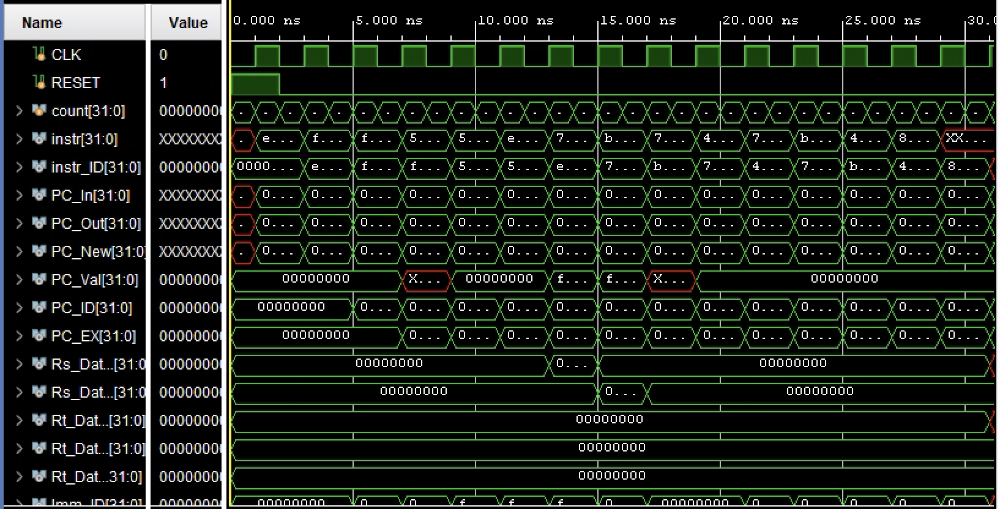
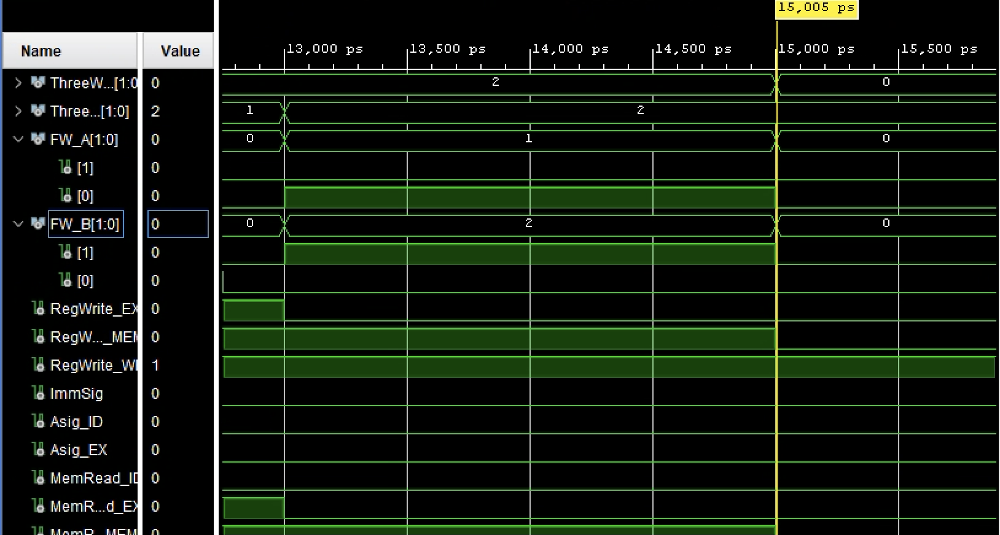

# Five-Stage Pipelined CPU (Verilog-2001)

This CPU design includes instruction and data memories, a 32×32 register file, a 32-bit ALU, forwarding logic, hazard detection, and a functional testbench developed and simulated using Xilinx tools. This project implements a five-stage pipelined CPU in Verilog-2001 based on an educational 13-instruction ISA completed as part of a Spring 2025 Computer Architecture course. This custom ISA supports R, I, and B instruction formats, arithmetic operations (ADD, SUB, NEG), memory access (LD, ST), and control flow (BRZ, BRN, J, JM), along with pseudo-instructions (SVPC, INC, MIN). The CPU executes one instruction per cycle under ideal memory assumptions.

| Feature                     | Notes                                           |
|----------------------------------|-------------------------------------------------|
| IF → ID → EX → MEM → WB pipeline | Isolated by register latches                    |
| 32 × 32 register file & ALU      | ADD / SUB / NEG / INC + flags                   |
| 2-bit forwarding network         | Eliminates load–use stalls                      |
| Combinational hazard detector    | 1-cycle bubble on unresolved dependencies       |
| Self-contained assembler         | SCU assembly → `.mem` images                    |
| Benchmarks: `min` & `vecadd`     | CPI formulas validated                          |

The datapath follows a traditional five-stage structure: IF → ID → EX → MEM → WB. Pipeline registers are placed between each stage. The control unit decodes a 4-bit opcode to generate all relevant control signals. A two-bit forwarding network enables MEM and WB bypass paths, and a combinational hazard detection unit stalls the pipeline when necessary.

- **Forwarding Unit** uses `FW_A` and `FW_B` to bypass EX/MEM & WB data.
- **Hazard Detector** freezes IF/ID and PC for exactly one cycle on detected hazards.

<details>
<summary><strong>🔧 Simulation & Setup (Xilinx)</strong></summary>

&nbsp;

Developed and tested using **Xilinx Vivado** with the built-in simulation tools (XSIM). To test:

1. Create or open a Vivado project.
2. Add all Verilog modules from `src/` and the testbench `tb.v` from `testbench/`.
3. Place the desired benchmark (`min.mem` or `vecadd.mem`) in the simulation directory and ensure the instruction and data memory modules initialize from those files. Example:

```verilog
initial $readmemb("min.mem", data);
```

4. Run the simulation for at least **200 cycles** using the Vivado waveform viewer or console output to inspect register and memory behavior.

5. Verify correct execution by examining logs and waveforms. These confirm hazard resolution, forwarding, instruction sequencing, and CPI predictions. The simulation uses a 2 ns clock period (500 MHz), with `RESET` deasserted at 2 ns and runs for 400 ns total.

</details>

## ⭐️ Performance Benchmarks

- Timing model: 2 ns memory · 1.5 ns register · 2 ns ALU → **T_clk = 2 ns (500 MHz)**.
- Benchmarks:
  - `min`: scans array `a[]` of length `n`, compares each value using `LD`, `SUB`, and conditional `BRN`, tracks minimum manually.

    $$
    \text{Cycles} = 5n + 9,\quad \mathrm{CPI} = 5 + \frac{9}{n}
    $$

  - `vecadd`: performs `c[i] = a[i] + b[i]` with sequential `LD–LD–ADD–ST` operations and forwarding.

    $$
    \text{Cycles} = 2n + 4,\quad \mathrm{CPI} = 2 + \frac{4}{n}
    $$

### Min

<p align="center">
  <br>
  
</p>

### VecAdd

<p align="center">
  <br>
  
</p>

<details>
<summary><strong>Clock Timing Verification</strong></summary>

<p align="center">
  <br>
  
</p>

</details>

## ⭐️ Notes

The design is **simulation-only**: memories are ideal 0-wait-state blocks, and there’s no branch prediction, interrupts, or long-latency ALU ops (mul/div). Real FPGA speed would drop ~20–30% after routing. Regardless, this processor demonstrates correct hazard handling, instruction sequencing, and cycle-accurate behavior across the benchmark programs. It achieves CPI values matching theoretical predictions in modern pipeline design and verification achieving theoretical CPI formulas and a worst case stage delay of 2 ns (≈ 500 MHz).

---
