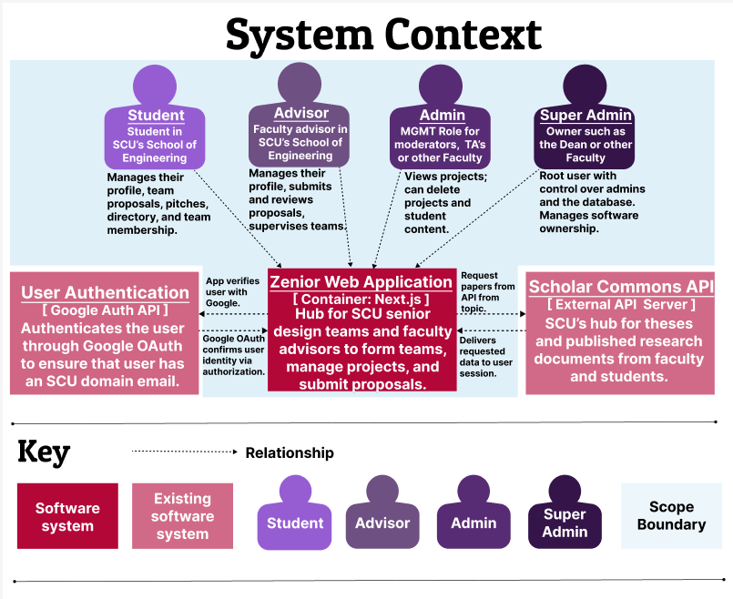
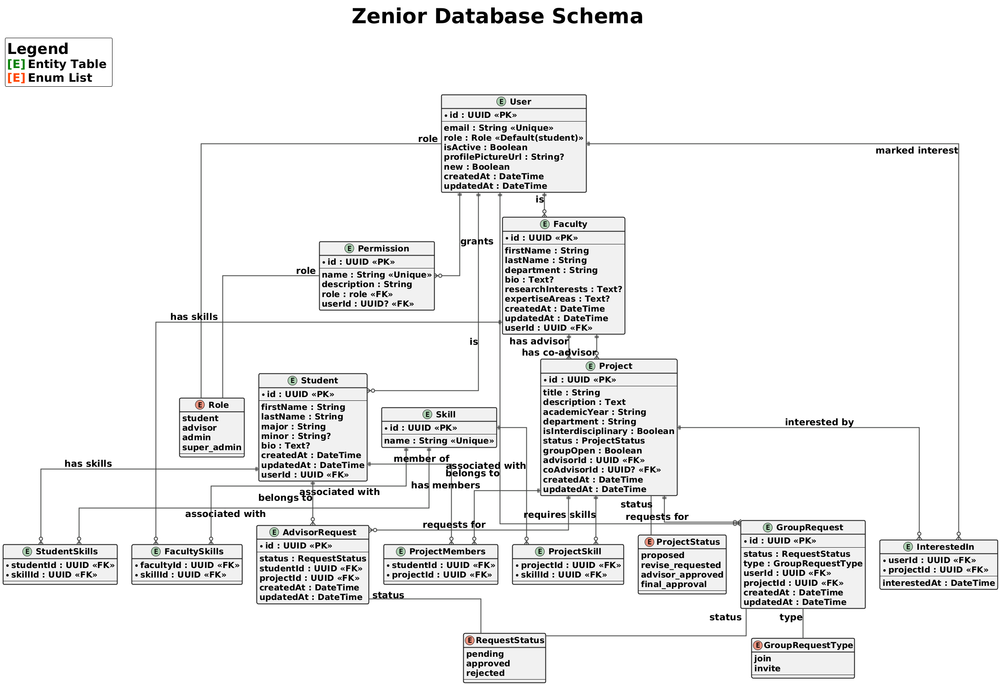

<p align="center">
  
  
  
</p>

<p align="center">
  Curated relevant technical projects completed during the Academic Year 2024–2025.  
  <br/>
  <em>Please expand each section below for details and source code.</em>
</p>

<p align="center">
  
</p>

### ⭐️ Overview

| # | Project               | TL;DR                                                           | Tech                        |
|----|------------------------|------------------------------------------------------------------|-----------------------------|
| 1️⃣ | **ALGAE**              | Autonomous Benthic Rover                                                | ROS 2 · Python              |
| 2️⃣ | **5GCORE**             | Containerized 5G core                                           | Python · Open5GS            |
| 3️⃣ | **CPU Pipeline**       | Five stage pipelined CPU w/ forwarding                         | Verilog · Xilinx            |
| 4️⃣ | **SCADA Trust Model**  | Adaptive trust scoring for low-latency industrial networks     | Python                      |
| 5️⃣ | **SOCI Data Analysis** | Linear models for caregiver stress using public health data    | R · ggplot2                 |
| 6️⃣ | **ZENIOR**             | Full‑stack project collaboration platform                       | Next.js · Supabase          |
| 7️⃣ | **Additional Projects**| Compilers · InfoSec · IoT Systems                              | C · C++ · Risk Analysis     |

$~$

<details>
<summary><strong>1️⃣ ALGAE</strong></summary>

&nbsp;

<p align="center">
  
</p>

Autonomous/tether-operated benthic rover that vacuums invasive algae from Lake Tahoe’s lakebed, slashing diver hours, toxin exposure, and overall cost.

* **Scope:** Senior capstone, Santa Clara U. Robotics Systems Lab  
* Status: 2nd-gen rover deployed Spring 2025; code embargoed until paper is published on scholar comms? (link)?.
* **My role:**   
  * Electrical redesign · ROS 2 + GUI software · topside comms 
  * Pressure-compensated electronics pod depth-rated to 10 m (<0.05 psi leakback)
  * Modular “Green” (rapid Python) & “Blue” (ROS 2 + Docker) stacks  

🔗 [Full docs](./ALGAE/README.md)  
🔗 [Project website](https://algae-rsl.github.io)  
🔗 [GitHub organisation](https://github.com/ALGAE-RSL)

</details>

<details>
<summary><strong>2️⃣ 5GCORE</strong></summary>

&nbsp;

<p align="center">
  
  
</p>


**CSEN241 (Graduate Cloud Computing)** Final Project (Weeks 6–10):  
In approximatly 3.5 weeks I containerized Open5GS into modular network functions and built a real-time security layer that detects rogue base stations with fuzzy logic trust scoring, all while logging full NF-to-NF provenance for forensic-grade attack attribution.  

This project explored an under addressed attack surface between the RAN and 5G Core, prototyped dynamic trust enforcement with ~9 ms auth latency and <15 % overhead, and demonstrated that zero-trust security can be embedded natively into cloud-native 5G architectures—even across hybrid edge/cloud environments.  


<p align="center">
  
</p>

🔗 [More Information](./5GCORE/README.md)  
📄 [Paper](./5GCORE/docs/5GCORE_MW.pdf)

</details>


<details>
<summary><strong>3️⃣ CPU Pipeline</strong></summary>

&nbsp;

Custom five-stage pipelined CPU in Verilog with a minimal 13-instruction ISA, forwarding logic, and dynamic hazard detection. Includes assembler, two hand assembled benchmarks (`min`, `vecadd`), and waveform verification. All modules were built from scratch and verified using a custom testbench and simulation for the Computer Archetecture course in Spring 2025.

🔗 ⭐️ [Full Project Analysis](./CPU_Pipeline)

<p align="center">
  
</p>

</details>


<details>
<summary><strong>4️⃣ SCADA Trust Model</strong></summary>

&nbsp;  

This short term research project explored the feasibility of applying **reputation-based trust modeling** inspired by systems used in online marketplaces and social platforms to resource constrained industrial networks. Using the publicly available Cisco Networks of Computing Hosts dataset as a stand, in for SCADA/ICS traffic, I designed a hybrid **fuzzy logic + temporal behavior model** that flags rogue or anomalous nodes in under 1 millisecond per decision cycle.  

The model achieved >90 % detection accuracy while remaining lightweight enough for embedded hardware. This open-ended research was developed in the final three weeks (Weeks 7–10) of CSEN 353: Trust and Privacy in Online Social Networks (Fall 2024), with a focus on applicability to defense systems and power grid resilience where infrastructure cannot afford delay, drift, or false trust.Beyond the core model I also proposed multi layer mitigation.

> Imagine this embedded in a substation or BMS controller watching for drift, blocking threats, never needing a UI.

⭐️ [Paper PDF](./SCADA_Trust_Model/353Scada.pdf)

</details>


<details>
<summary><strong>5️⃣ SOCI Data Analysis</strong></summary>

&nbsp;

Placeholder

🔗 [Full details →](./SOCI_Data_Analysis/README.md)

</details>


<details>
<summary><strong>6️⃣ ZENIOR</strong></summary>

&nbsp;

<p align="center">
  
</p>

<p align="center">
    
    
    
    
    
    
    
</p>

ZENIOR is a full-stack platform built to support rising juniors in Santa Clara University’s School of Engineering as they begin preparing for senior design projects. The application provides structured pathways for students to explore proposed research topics, form project groups, and request faculty advisors. At the same time, it enables faculty members to publish project ideas, manage student interest, and participate in structured advising workflows. The system emphasizes role-based access control, guided project progression, and a clean, modern UI to promote usability and academic collaboration.

  This was a collaborative group project for 174: Software Engineering, developed over an 8-week sprint cycle using Agile methods and Trello for task coordination. I contributed extensively to both the backend and frontend, designing the full schema, implementing backend routing logic, building page-level components, performing security testing, and verifying access control edge cases. I also handled Supabase integration and helped document the system setup for deployment.

  The team selected Next.js for routing and server-side rendering, Prisma as the ORM layer, and Supabase for authentication and storage. React, Tailwind CSS, and Shadcn/UI were used on the frontend to ensure a responsive and consistent user experience. This stack enabled modular development and maintainable component structures, supporting the platform’s goal of long-term adaptability.

**Note:** The public site is no longer active, as the hosted database required a Supabase subscription and was shut down in Feb 2025.


## ⭐️ Diagrams

<details>
  <summary><strong>System Context</strong></summary>
  <br>




</details>

<details>
  <summary><strong>C4 Container</strong></summary>
  <br>


</details>

<details>
  <summary><strong>Schema</strong></summary>
  <br>



</details>

## ⭐️ Demonstration 

<video width="100%" controls>
  <source src="./ZENIOR/diagrams/demo.mp4" type="video/mp4">
</video>

<p align="center">
  
</p>

## ⭐️ Links 

🔗 [SRC/Codebase](./ZENIOR/README.md)  
🔗 [Official Fork](https://github.com/marleyyvon/csen-174-f24-project-zenior)  
🔗 [Demo Video](https://github.com/marleyyvon/ZENIOR/diagrams/demo.mp4) 

</details>


<details>
<summary><strong>7️⃣ Additional Projects</strong></summary>

&nbsp;

Other related academic projects:

- **Graduate Information Security:** Focused on infrastructure risk modeling, NIST-based analysis, and telecom vulnerability research.  
- **Compiler Design and Theory:** Developed a recursive-descent compiler for a C-like language with semantic analysis and assembly output.  
- **Graduate IoT – Project Integrate:** Explored integration of embedded hardware with wireless protocols and cloud communication pipelines.

<details>
<summary><strong>⭐️ Verizon Analysis</strong></summary>

&nbsp;

| Deliverable                                 | Focus                                                      | Take‑aways                                              |
| ------------------------------------------- | ---------------------------------------------------------- | ------------------------------------------------------- |
| **5G Core Applications Threat Report**      | Analyzed vulnerabilities in Verizon’s 5G Core architecture | Threat modeling · Telecom protocols · Technical writing |
| **Wireless Infrastructure Risk Assessment** | Applied NIST 800-30 to identify and rank risks             | Risk matrices · Control mapping · Executive reporting   |

🔗 PDFs: [`250_5G_Report.pdf`](./Additional_Projects/InfoSec/250_5G_Report.pdf) • [`250_Risk_Mgmt.pdf`](./Additional_Projects/InfoSec/250_Risk_Mgmt.pdf)

</details>

<details>
<summary><strong>⭐️ C Compiler</strong></summary>

&nbsp;

Source code is available in the [phase](./Additional_Projects/Compilers/phase/) folder.

This compiler was developed as part of a structured, multi-phase course project. While the project scaffolding was provided by the instructor, I implemented all core logic phases including:

- Lexical analyzer  
- Recursive-descent parser  
- Semantic checker  
- Intermediate code generator  

It compiles a subset of C into 32-bit Intel assembly.

**How to run:**
```bash
cd Compilers/phase
make                           # builds the compiler (./scc)
./scc < ../examples/qsort.c    # generates assembly
gcc -m32 qsort.s -o qsort      # assembles + links (requires 32-bit support)
./qsort < ../examples/qsort.in # runs the compiled binary
```

This process outputs a `.s` file you can inspect directly to view the generated assembly code.

**Example:**
```c
int main() {
    int x;
    x = 3 + 4;
    return x;
}
```

Produces:
```asm
        .text
        .globl main
main:
        li $t0, 3
        li $t1, 4
        add $t2, $t0, $t1
        move $v0, $t2
        jr $ra
```

</details>

<details>
<summary><strong>⭐️ Project Integrate</strong></summary>

&nbsp;

Project Integrate is a privacy-focused smart-home prototype that runs on a four-node Raspberry Pi mesh (one root, three leaf). Each node captures Wi-Fi traffic in monitor mode, extracts RSSI values with `pcap`, and exchanges those readings over a custom IPv6/UDP JSON protocol (“LML”). By averaging RSSI and applying a log-distance path-loss model, the system localises user devices to < 1 m accuracy and triggers Govee smart lights via local HTTPS—no cloud calls, no personal data leaving the LAN. My role covered the C++ backend such as the LML packet format, root/leaf daemons, channel-sync thread, and the signal pipeline to convert raw RSSI into actionable proximity events. I also implemented fallback logic for packet delivery in noisy 2.4 GHz conditions.

&nbsp;

🔗 Forked repo: <https://github.com/marleyyvon/ProjectIntegrate>  
🔗 Paper (PDF): [Integrate/Integrate.pdf](./Additional_Projects//Integrate/Integrate.pdf)

</details>

&nbsp;

🔗 [Repo](./Additional_Projects)

</details>


&nbsp;

---
