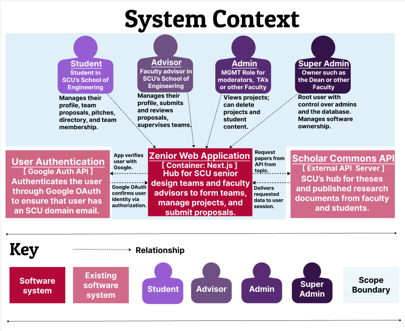
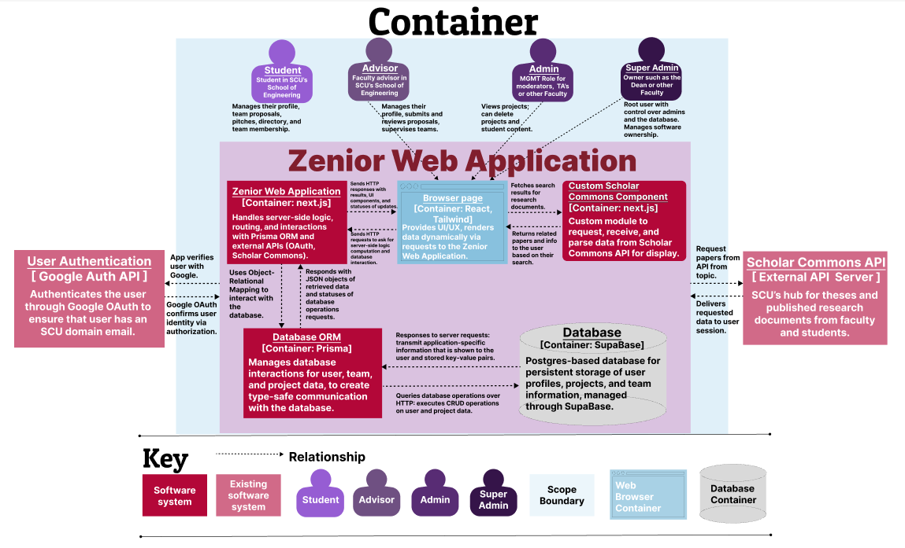
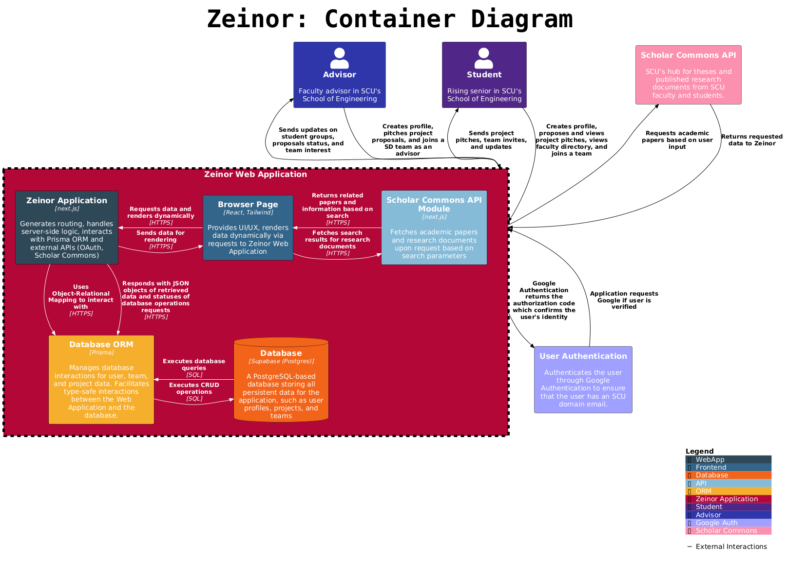

<p align="center">
  
</p>

<p align="center">
    <a href="https://github.com/CSEN-SCU/csen-174-f24-project-zenior/releases" alt="Pre-release">
        
    </a>
    <a href="https://github.com/CSEN-SCU/csen-174-f24-project-zenior/blob/main/LICENSE" alt="License Badge">
        
    </a>
    <a href="https://github.com/CSEN-SCU/csen-174-f24-project-zenior/commits" alt="Last Commit">
        
    </a>
    <a href="https://github.com/CSEN-SCU/csen-174-f24-project-zenior/graphs/contributors" alt="Contributors">
        
    </a>
</p>

<p align="center">
    
    
</p>

## 🌐 About

<p align="center">
    
    
    
    
    
    
    
</p>

<p align="center">
    Zeinor is a comprehensive platform for rising juniors in the School of Engineering, designed to facilitate their preparation for senior design projects. It offers tools for students to explore and plan their projects efficiently for the upcoming year. Additionally, the platform enables faculty members to submit research topics and project opportunities that students can collaborate on, fostering a dynamic and collaborative environment for academic development and innovation.
</p>

### 🌎 Features

- ⚡ **Project Planning and Exploration**: Assists juniors in the School of Engineering to discover and organize their senior design projects efficiently.
- ✨ **Faculty Collaboration**: Faculty members can submit research topics and project ideas, making it easy for students to connect with real-world opportunities.
- 📈 **Track Progress**: Monitor the progress of projects with updates for both students and faculty.
- 💼 **Resource Management**: Access and manage resources such as research papers, tools, and mentorship opportunities provided by faculty.
- 🔍 **Search and Discover**: Easily browse through available projects and faculty-submitted opportunities, enhancing student-faculty interactions and project discovery.

## 🚀 Get Started

<details>
  <summary><strong>🔧 Setup </strong></summary>

<br>

🔑 **Environment Setup:** 

  Get the `.env` file from the Zenior administrators and place it in the root of the project (next to `package.json`).

💻 **Install Dependencies:** 

Run the following command to install the necessary packages:  

   ```bash  
   npm install  
   ```

🏭 **Generate Prisma Client:**  

   Run this command to generate the Prisma client:  

   ```bash  
   npx prisma generate  
   ```

📶 **Run the Development Server:**  

   Start the development server with:  

   ```bash  
   npm run dev  
   ```  
   Then open [http://localhost:3000](http://localhost:3000) in your browser.

📊 **Optional: Run Prisma Studio:** 

   To visually work with the database, run:  

   ```bash  
   npx prisma studio  
   ```

</details>

<details>
  <summary><strong>🔰 Learn More</strong></summary>
  <br>

To learn more about the technology used in this project, take a look at the following resources:

  **[Next.js Documentation:](https://nextjs.org/docs)** Learn about Next.js features and API.

  **[Learn Next.js:](https://nextjs.org/learn)** An interactive Next.js tutorial.

  **[React Docs:](https://react.dev/)** React documentation with examples and references.

  **[Tailwind CSS Documentation:](https://tailwindcss.com/docs)** Learn how to use Tailwind utility classes.

  **[Prisma Documentation:](https://www.prisma.io/docs/orm)** Learn about Prisma ORM.

  **[Supabase Documentation:](https://supabase.com/docs)** Learn about Supabase tools and features.

  **[Shadcn/ui Documentation:](https://ui.shadcn.com/docs)** Learn about Shadcn/ui components and examples.

</details>

<details>
    <summary><strong>📎 Tech Stack </strong></summary>
<br>

🔹 **React:** React is a JavaScript library for building user interfaces. It is backed by a large company and maintained by a community of individual developers, making it both reliable and open, with a large number of libraries and tools available. Compared to Vue, Angular, and Svelte (other popular frontend frameworks), React is the most popular and has the most libraries and packages available. It's also the most widely used frontend framework in the industry, making it a great skill to learn.

🔹 **Next.js:** Next.js is a React framework that provides a solution for server-side rendering, static site generation, and more. It's backed by Vercel, a company that provides hosting and ecosystem for React and Next.js.

🔹 **Prisma:** Prisma is a modern database toolkit that makes it easy to work with databases. It provides an ORM (Object-Relational Mapping) that allows you to interact with the database using JavaScript objects. It also provides a schema migration tool that allows you to easily update the database schema. Prisma is a great choice for this project because it provides a simple and easy-to-use API for working with databases and a studio web client to visually interact with the database without the need to share Supabase accounts and credentials.

🔹 **Supabase:** Supabase is an open-source alternative to Firebase that provides a suite of tools for building web applications. It includes a database, authentication, and storage services, as well as a real-time subscription service. Supabase is a great choice for this project because it is free and open source, which doesn't tie us to a proprietary platform and allows us to host the database ourselves if we decide to. Compared to Firebase, Supabase is more open and flexible, and it provides a more modern and developer-friendly API that integrates with Prisma and allows us to easily switch database providers.

🔹 **Tailwind CSS:** Tailwind CSS is a utility-first CSS framework that provides a set of utility classes that can be used to style HTML elements. It is a great choice for this project because it allows us to quickly style the UI without writing custom CSS. It also provides a consistent and maintainable way to style the UI, making it easy to update and modify the styles as needed. Compared to other CSS frameworks like Bootstrap and Material-UI, Tailwind CSS is more flexible and customizable, allowing us to create a unique and modern design for the project that doesn't look like a generic template.

🔹 **Shadcn/ui:** Shadcn/ui is a React component library that provides a set of reusable UI components that can be used to build web applications. It is a great choice for this project because it provides a set of modern and responsive components that can be easily customized and styled using Tailwind CSS. It also provides a consistent and cohesive design for the project, making it easy to create a professional and polished UI. Compared to other component libraries like Material-UI and Ant Design, Shadcn/ui is more lightweight and flexible, allowing us to easily integrate it with Tailwind CSS and customize the components to fit the design of the project. It also gives us the access to the source code of the used components, which allows us to change and modify them as needed, to achieve a unique design for the project.

</details>

<details>
  <summary><strong>🍃 PlantUML</strong></summary>
<br>

The `diagrams` folder will hold diagrams that may change over time. Check out [PlantUML](https://plantuml.com/) to create and manage diagrams.

🌱 **Setup PlantUML in VS Code**  
- Install the "PlantUML" VS Code extension.  
- In settings, configure the following:  
  - **Plantuml: Server** → `https://www.plantuml.com/plantuml`.  
  - **PlantUML: Render** → Set to **PlantUML Server**.  
- Ensure **Java** is installed on your system.

🌿 **Preview, Export, and Organize Diagrams**  
- Use the command palette (`Ctrl + Shift + P` or `Cmd + Shift + P` on Mac), and select:  
  - **"PlantUML: Preview Current Diagram"** to preview your diagram.  
  - **"PlantUML: Save Current Diagram As..."** to export the diagram in your preferred image format.  
- Set **PlantUML: Export Out Dir** in settings to `./diagrams/images` to ensure all exported images are saved in the correct folder.  
- (Optional) Set **PlantUML: Diagrams Root** in VS Code settings to your diagrams folder (e.g., `./diagrams`) for better organization.

🌳 **Create C4 Model Diagrams**  
- Use the [C4-PlantUML library](https://github.com/plantuml-stdlib/C4-PlantUML) to create C4 diagrams. This ensures you always use the latest version of the library directly from GitHub without managing local files.
- Include the library in your `.puml` file by adding:  

  ```bash
  !include https://raw.githubusercontent.com/plantuml-stdlib/C4-PlantUML/master/C4_Container.puml
  ```

</details>


## 📊 Diagrams

<details>
  <summary><strong>🗺️  C4 System Context</strong></summary>
  <br>




</details>

<details>
  <summary><strong>🏗️ C4 Container</strong></summary>
  <br>





</details>

<details>
  <summary><strong>💠 Schema</strong></summary>
  <br>


</details>

## 📋 License

This project is licensed under the [GNU General Public License v3.0 (GPLv3)](https://www.gnu.org/licenses/gpl-3.0.html). This license grants you the freedom to use, study, modify, and share the software. However, any modifications or derived works must also be distributed under the same license.

For the complete terms, see the [LICENSE](./LICENSE) file.
